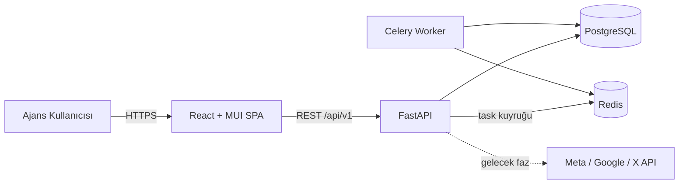

# Mimari

## Genel Bakış

Monorepo: ayrı **FastAPI backend** ve **React frontend**, ortak
`docker-compose` ile çalışır. PostgreSQL veri deposu, Redis ise Celery
broker/result store olarak kullanılır.



## Backend Katmanları

```
app/
├── main.py            # FastAPI app, CORS, router kayıtları
├── core/config.py     # Pydantic Settings (env'den) — secret burada okunur
├── db/                # base (Declarative Base + TimestampMixin), session
├── models/            # SQLAlchemy modelleri
├── schemas/           # Pydantic request/response şemaları
├── api/v1/            # router + endpoints/
├── services/          # iş mantığı + mock veri üreticileri
├── workers/           # Celery app & task'lar
└── tests/             # pytest
```

**Akış**: `endpoint (router)` isteği alır → `service` iş mantığını çalıştırır
(DB veya mock) → `schema` ile yanıt döner. Endpoint'ler ince, mantık
service'lerde tutulur.

## Frontend Katmanları

```
src/
├── main.tsx           # giriş
├── App.tsx            # Theme + Router + Layout
├── api/               # axios client, çağrı fonksiyonları
├── components/        # tekrar kullanılabilir bileşenler
├── features/<modul>/  # modül bazlı sayfalar (dashboard, clients, ...)
├── layouts/           # AppLayout (sidebar + topbar)
├── routes/            # route tanımları
└── theme/             # MUI tema
```

## Async / Arka Plan İşleri

- `app/workers/celery_app.py` Celery uygulamasını tanımlar.
- Kullanım senaryoları (sonraki fazlar): zamanlanmış gönderi yayını (mock),
  periyodik mock analytics üretimi, SEO taramaları, rapor üretimi.

## Veritabanı & Migration

- SQLAlchemy 2.0 (typed `Mapped`) modelleri `app/models/` altında.
- Alembic ile versiyonlu migration. DB URL'i env'den (`alembic/env.py`).

## Kimlik Doğrulama

- JWT (access + refresh), bcrypt parola hash.
- Rol tabanlı yetki: FastAPI dependency'leri ile endpoint koruması.

## Ortam & Dağıtım

- Geliştirme: `docker compose up --build`.
- CI: GitHub Actions — backend (ruff + pytest), frontend (tsc + vitest).
- Konfigürasyon 12-factor: tüm ayar env üzerinden.
