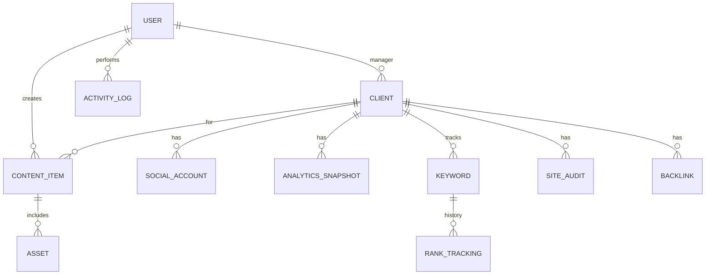

# Veri Modeli

Bu doküman planlanan temel varlıkları (entity) ve ilişkilerini tanımlar.
Modeller fazlar ilerledikçe `backend/app/models/` altında uygulanacaktır.

## ER Diyagramı

## Varlıklar

### User (ajans çalışanı)
| Alan | Tip | Not |
|------|-----|-----|
| id | int (PK) | |
| email | str (unique) | giriş |
| hashed_password | str | bcrypt |
| full_name | str | |
| role | enum | admin, manager, content_creator, analyst, seo_specialist |
| is_active | bool | |
| created_at / updated_at | datetime | |

### Client (müşteri şirket)
| id, name, industry, website, status (active/paused/archived), manager_id (FK→User) |

### SocialAccount (mock — gerçek token yok)
| id, client_id (FK), platform (enum: instagram/facebook/x/linkedin/tiktok/youtube), handle, follower_count, avatar_url |

### ContentItem (gönderi)
| id, client_id (FK), title, body, platforms (list), status (draft→pending_review→approved→scheduled→published), scheduled_at, published_at, created_by (FK→User), approved_by (FK→User) |

### Asset (medya)
| id, content_item_id (FK, nullable), type (image/video/doc), url, filename |

### AnalyticsSnapshot (mock metrik)
| id, client_id (FK), social_account_id (FK, nullable), date, reach, impressions, engagement, followers |

### Report
| id, client_id (FK), period_start, period_end, generated_by (FK→User), summary (json), created_at |

### Keyword (SEO)
| id, client_id (FK), term, target_url, search_volume |

### RankTracking (SEO geçmişi)
| id, keyword_id (FK), date, position |

### SiteAudit (SEO denetim, mock)
| id, client_id (FK), date, score, issues (json) |

### Backlink (SEO, mock)
| id, client_id (FK), source_url, authority, discovered_at |

### ActivityLog (denetim kaydı)
| id, user_id (FK), action, entity_type, entity_id, created_at |

## Notlar
- Tüm modeller `TimestampMixin` (created_at/updated_at) kullanır.
- Mock veriler `app/services/` altındaki üreticiler ile doldurulur.
- İlişkiler ileride uygulanırken FK + index'ler eklenecek.
